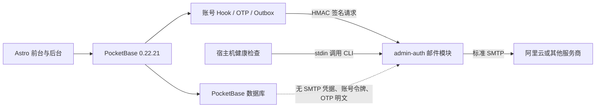

# 博客通用邮件平台最终设计

日期：2026-07-13
状态：架构与自定义 OTP 已确认，等待用户审阅书面规格
适用版本：PocketBase 0.22.21、PocketBase JS SDK 0.27、Astro 6、现有 Docker Compose 架构

本文件是唯一正式设计，取代同日的邮件设计草稿。草稿中的 PocketBase 直接 SMTP、`$app.newMailClient()` 发送 Outbox、业务管理员地址双重配置和 PocketBase 告警历史等描述均不再有效。

## 1. 已确认决策

1. 复用现有 `admin-auth` Node 服务增加邮件模块，不新增常驻容器。
2. 使用 Nodemailer 和标准 SMTP。阿里云邮件推送是首个生产服务商，但代码不依赖阿里云专有 API。
3. PocketBase 管理事件、模板、Outbox、OTP、权限和审计，通过签名内部请求调用 Node 邮件网关。
4. SMTP 主机、用户名和密码只进入 `admin-auth` 的服务器环境，不进入 PocketBase 数据库、API、前端、日志或 Git。
5. 保留 PocketBase 0.22.21，并实现仅供普通读者使用的自定义 OTP，不进行全量 PocketBase 升级。
6. 先在当前电脑完成自动化和 Mailpit 端到端测试，得到明确批准后才接触生产服务器。

## 2. 已验证事实

- 当前服务端是 PocketBase `0.22.21`，前端 SDK 是 `0.27`。
- `configure_smtp.pb.js` 使用 0.22.21 不存在的 `$app.save(settings)`，本机已复现启动失败。
- 运行时修改 `$app.settings()` 不能稳定保留到后续请求，无法满足 SMTP 密码不落库。
- PocketBase 0.22.21 的 Mailer Before Hook 成功转发后返回 `false`，会停止 Hook 传播、跳过默认 `MailClient.Send`，并对上层返回成功。
- 0.22.21 没有前端当前调用的原生 OTP API，现有“邮箱验证码登录”不可用。
- 本机原型已经验证 `PocketBase -> Node 内部网关 -> 标准 SMTP -> Mailpit`；未授权请求被拒绝，测试 SMTP 密码未写入 PocketBase 数据库。

版本依据：

- [PocketBase 0.22.21 邮件发送实现](https://github.com/pocketbase/pocketbase/blob/v0.22.21/mails/record.go)
- [PocketBase 0.22.21 JS Hook 绑定实现](https://github.com/pocketbase/pocketbase/blob/v0.22.21/plugins/jsvm/binds.go)
- [PocketBase 0.23 JSVM 迁移说明](https://pocketbase.io/v023upgrade/jsvm/)

## 3. 目标和非目标

### 3.1 目标

- 支持阿里云以及其他标准 SMTP 服务商。
- 完成注册验证、密码重置、邮箱变更和 reader OTP 四类账号邮件。
- 完成新评论、审核通过和回复三类业务通知。
- 完成容器、站点健康、备份、磁盘故障及恢复告警。
- 提供仅 `super_admin` 可访问的 `/admin/mail` 管理中心。
- 业务通知具备持久 Outbox、去重、重试、取消、抑制和最小投递日志。
- 修复邮件乱码、损坏 HTML、缺失页面和错误 SMTP Hook。
- 邮件故障不影响 Passkey、评论保存、站点浏览和普通密码登录。

### 3.2 非目标

- 不提供营销群发、订阅简报、附件、入站邮件或回复处理。
- 不实现 SMTP 服务商自动故障切换；切换服务商只修改环境变量并重启 `admin-auth`。
- 第一版不接入阿里云退信 Webhook。
- 不升级 PocketBase 或迁移全部现有 Hook 到新事件 API。
- 不允许后台读取、编辑、导出或回显 SMTP 凭据。
- 不承诺在 Docker 或 `admin-auth` 自身停止时仍能发送邮件。

## 4. 架构

### 4.1 `admin-auth` 内的邮件模块

保持服务名、容器名和端口不变，内部增加四个独立单元：

- 配置模块：读取标准 SMTP 变量，兼容阿里云旧变量，验证 TLS 和超时，生成脱敏状态。
- 传输模块：封装 Nodemailer、固定发件人、错误分类和日志清洗。
- 内部 API：验证 HMAC、时间和 nonce，限制请求体、收件人数和内容大小。
- CLI：读取 stdin 中的固定运维事件并发送告警，不把正文放进进程参数。

SMTP 缺失、认证失败或连接失败不能让 `admin-auth` 退出。现有 `/health` 只检查 Node 与认证模块存活，邮件状态使用独立受保护接口。这样邮件故障不会连带破坏 WebAuthn。

### 4.2 PocketBase

- Mailer Before Hook 拦截验证、重置和邮箱变更邮件。
- 自定义路由负责 OTP 请求和核验。
- 评论 Hook 只创建 Outbox，不直接发送。
- 定时任务处理 Outbox、陈旧锁和数据保留。
- 自定义后台 API 负责脱敏、权限、命令和审计。
- PocketBase 永远不读取 SMTP 主机、用户名或密码。

### 4.3 Astro

- OTP 表单切换到项目自定义 API。
- 增加忘记密码、重置密码、邮箱变更和确认页面。
- 增加 `/admin/mail` 并沿用现有 `AdminLayout`、侧栏和权限模型。
- 公共账号请求使用统一防枚举文案，不展示原始服务端或 SMTP 错误。

## 5. 配置和凭据边界

### 5.1 `admin-auth` 专用变量

| 变量 | 说明 |
| --- | --- |
| `SMTP_HOST` | SMTP 主机 |
| `SMTP_PORT` | SMTP 端口 |
| `SMTP_USERNAME` | SMTP 用户名 |
| `SMTP_PASSWORD` | SMTP 密码或专用凭据 |
| `SMTP_FROM_ADDRESS` | 已验证发件地址 |
| `SMTP_FROM_NAME` | 发件人名称 |
| `SMTP_TLS_MODE` | `implicit`、`starttls` 或 `auto` |
| `SMTP_CONNECTION_TIMEOUT_MS` | 有上下限的建连超时 |
| `SMTP_SOCKET_TIMEOUT_MS` | 有上下限的发送超时 |
| `MAIL_PROVIDER_LABEL` | 非敏感显示标签 |
| `MAIL_ALERT_RECIPIENTS` | 运维告警地址 |

通用变量缺失时可读取 `ALIYUN_SMTP_HOST`、`ALIYUN_SMTP_PORT`、`ALIYUN_SMTP_USER`、`ALIYUN_SMTP_PASSWORD`、`ALIYUN_FROM_EMAIL` 和 `ALIYUN_FROM_NAME`，但新文档只推荐通用名称。`auto` 模式下 465 使用隐式 TLS，其他端口使用 STARTTLS；生产禁止明文 SMTP。

### 5.2 跨服务和 PocketBase 变量

| 变量 | 注入范围 | 说明 |
| --- | --- | --- |
| `MAIL_INTERNAL_SECRET` | PocketBase、`admin-auth` | 邮件内部签名密钥，至少 32 字符 |
| `MAIL_HASH_SECRET` | 仅 PocketBase | OTP、邮箱和 IP 的命名空间 HMAC 密钥，至少 32 字符 |
| `MAIL_GATEWAY_INTERNAL_URL` | 仅 PocketBase | Docker 内部邮件网关地址 |
| `PUBLIC_SITE_URL` | 两个服务 | 邮件链接的受信站点根地址 |
| `MAIL_GATEWAY_ENABLED` | 仅 PocketBase | 内部网关调用开关 |
| `MAIL_ACCOUNT_ENABLED` | 仅 PocketBase | 账号邮件开关 |
| `MAIL_OTP_ENABLED` | 仅 PocketBase | 自定义 OTP 开关 |

业务管理员收件人只保存在 `mail_rules`，不存在环境变量和数据库两套来源。运维地址只来自 `MAIL_ALERT_RECIPIENTS`，不受 PocketBase 管理。

Compose 必须移除 PocketBase 当前收到的所有 `ALIYUN_*` 凭据。生产环境文件由 root 持有、权限 `0600`，不打包、不进镜像和 Git。

后台状态只返回是否配置、服务商标签、端口、TLS 模式、发件域名和检查时间，不返回 SMTP 主机、用户名、密码或完整发件地址。

## 6. 内部邮件协议

### 6.1 路由

- `POST /internal/mail/send`：发送一封邮件。
- `POST /internal/mail/verify`：验证 SMTP 连接但不发信。
- `GET /internal/mail/status`：返回脱敏状态。

路由只在 Docker `blog_network` 暴露，不映射公网端口。

### 6.2 HMAC 认证

请求包含：

- `X-Mail-Timestamp`：Unix 秒，允许最大 60 秒偏差。
- `X-Mail-Nonce`：加密安全随机值。
- `X-Mail-Signature`：对时间、nonce 和原始请求体摘要计算 HMAC-SHA256。

网关在解析 JSON 前验证签名，使用常量时间比较和有上限的短期 nonce 缓存拒绝重放。失败统一返回 `401`，日志不记录签名、nonce 或请求体。

### 6.3 发送契约

每个请求只允许一个收件人：

- `requestId`：无用户信息的关联 ID。
- `messageId`：Outbox 使用稳定 ID，减少不确定重试造成的重复展示。
- `category`：固定枚举。
- `to`：内部请求中的完整地址。
- `subject`：移除 CR/LF，最大 255 字符。
- `html`：最大 256 KiB。
- `text`：最大 128 KiB，必须提供。

调用方不能指定发件人、任意 Header、附件、抄送或密送。发件人固定取环境配置，防止网关成为开放中继。

## 7. 账号邮件

| 类型 | 发送 | 失败行为 |
| --- | --- | --- |
| 注册验证 | PocketBase 生成令牌，Hook 同步转发 | 注册不回滚，记录失败，允许重发 |
| 密码重置 | PocketBase 生成令牌，Hook 同步转发 | 始终返回统一受理文案 |
| 邮箱变更 | PocketBase 生成令牌，Hook 发往新邮箱 | 保留旧邮箱，允许重试 |
| OTP | 自定义挑战同步转发 | 始终返回统一受理响应 |

验证、重置和邮箱变更令牌只在 Hook 单次执行内存中出现。它们不能进入 Outbox、投递日志、审计、错误日志或数据库。

Mailer Hook 无论网关成功还是已受控记录失败，都返回 `false`，绝不回落到 PocketBase 默认 MailClient。功能开关关闭时同样返回 `false`，只记录“未启用”；开关不改变凭据边界。

账号邮件不进入持久 Outbox。失败后由用户重新请求新令牌。管理中心只保存类型、脱敏地址、地址 HMAC、耗时、稳定错误分类和时间。

密码重置和验证邮件重发由 `/api/blog-auth/*` 门面接收。门面统一限流、最小响应时间和响应结构，再在服务端调用 PocketBase 令牌流程。Caddy 拒绝对应的内置公开“请求发信”端点，防止绕过门面；不负责发信的令牌确认端点继续公开。

## 8. 自定义 OTP

### 8.1 安全边界

- 只允许 `role = reader` 且邮箱已验证的账户。
- `author`、`admin`、`super_admin` 必须继续使用密码和 Passkey。
- 不存在、未验证和高权限邮箱都创建诱饵挑战并返回相同响应。
- OTP 成功只使用 `$apis.recordAuthResponse` 生成 PocketBase 标准认证结果，不自制登录 JWT。

### 8.2 请求验证码

`POST /api/blog-auth/otp/request`

1. 校验并规范化邮箱，限制请求体。
2. 用 `MAIL_HASH_SECRET` 对邮箱和来源 IP 做带命名空间的 HMAC。
3. 查询近期挑战，执行持久化的邮箱、IP 和全局限流。
4. 始终创建随机挑战 ID；有效 reader 关联用户，其余挑战的用户为空。
5. 用 `$security.randomStringWithAlphabet(6, "0123456789")` 生成六位加密安全验证码。
6. 只保存 `HMAC("otp-code:" + challengeId + ":" + code)`，不保存明文。
7. 只向有效 reader 发送邮件，但所有路径返回相同 `202` 结构并满足统一最小响应时间。

### 8.3 核验验证码

`POST /api/blog-auth/otp/verify`

1. 接收挑战 ID 和六位验证码，拒绝多余字段和超大请求。
2. 使用 `$security.equal` 常量时间比较 HMAC。
3. 挑战有效期 10 分钟，最多失败 5 次。
4. 在事务内原子增加尝试次数或一次性消费，防止并发重复使用。
5. 成功后使同一用户其他有效挑战失效。
6. 再次确认用户仍是已验证 reader，然后返回标准认证响应。
7. 失败统一返回同一错误，不区分不存在、过期、角色或验证码错误。

### 8.4 限流和保留

- 每个邮箱 15 分钟最多 3 次请求。
- 每个 IP 15 分钟最多 5 次请求。
- 全局每分钟最多 30 次请求。
- 每个挑战最多 5 次核验。
- 成功登录不清除限流历史。
- 挑战保留 24 小时后清理。

限流依赖持久挑战记录，不因 PocketBase 重启清空。数据库只含挑战随机 ID、可选用户关系、HMAC、时间、次数和消费状态。

## 9. 评论通知和 Outbox

| 事件 | 收件人 | 去重 |
| --- | --- | --- |
| 新评论 | 文章作者和规则中的管理员 | 评论者不通知自己，同一地址只发一次 |
| 审核通过 | 原评论者 | 只对首次转为 `approved` 发送 |
| 回复 | 被回复评论作者 | 回复者等于收件人时跳过，未公开内容不外发 |

评论和审核请求只创建 Outbox，SMTP 或模板故障不能回滚业务。

Outbox 状态为 `pending`、`processing`、`retry`、`sent`、`failed`、`cancelled`。单实例 PocketBase 每分钟领取有限批次：

1. 原子领取并写锁；五分钟以上陈旧锁可恢复。
2. 检查规则、模板、抑制名单和收件人。
3. 渲染 HTML 与纯文本，调用内部网关。
4. 成功后清除不再需要的 payload 并写最小日志。
5. 临时失败按 1 分钟、5 分钟、30 分钟、2 小时、12 小时退避，最多 5 次。
6. 永久地址错误直接失败；认证、配置和全局网络错误暂停批次，不能误抑制全部地址。

每条记录只对应一个收件人。`dedupe_key` 由事件、源记录、收件人 HMAC 和状态转换组成并建立唯一索引。

SMTP 无法保证严格 exactly-once。服务商已接收但响应丢失时，重试可能重复。稳定 Message-ID 和 Outbox 去重只降低概率，不作虚假保证。

## 10. 宿主机运维告警

宿主机定时检查：

- `blog-caddy`、`blog-pocketbase`、`blog-admin-auth` 运行与健康状态。
- `https://hlydwz.com/api/health`。
- 最近生产备份及其时效。
- 磁盘使用率阈值。

每项维护 `healthy`、`firing`、`recovered` 状态。首次失败发送一次，持续失败按冷却时间提醒，恢复后发送一次恢复通知。状态文件位于 `/var/lib/hlydwz-monitor/state.json`，权限 `0600`。

脚本把结构化事件从 stdin 传给容器内 `mail-cli`，不依赖 PocketBase。若 Docker 或 `admin-auth` 不可用，只写 journald。告警模板和收件人来自代码与 `MAIL_ALERT_RECIPIENTS`。

第一版后台只显示告警通道是否配置，不展示或编辑宿主机告警历史。真实结果以受保护的 journald 和状态文件为准。

## 11. 数据模型

所有邮件集合 API 规则默认 `null`。前端只能通过受保护的自定义 API 获取脱敏 DTO。

### 11.1 `mail_outbox`

- 事件、模板、完整收件地址、收件人名称和地址 HMAC。
- 最小业务 payload，禁止令牌、密码、Cookie、Authorization 和 SMTP 配置。
- 状态、尝试次数、下次时间、锁、稳定错误分类和发送时间。
- 源集合、源记录和唯一 `dedupe_key`。

已发送和取消记录保留 30 天，最终失败保留 90 天。

### 11.2 `mail_templates`

- `key`、名称、类别、版本、主题模板和结构化内容 JSON。
- 内容只含预标题、标题、段落、按钮文字和页脚，不保存任意可执行 HTML。
- 账号安全模板不可停用；评论通知由规则停用。
- 恢复默认会创建新版本，不抹除审计历史。

### 11.3 `mail_rules`

- 每个业务事件一条唯一规则。
- 启用状态、作者或评论者策略、管理员地址和最大重试次数。
- 业务管理员地址在保存前校验、规范化和去重，是唯一事实来源。
- 账号安全邮件和宿主机告警不受此集合控制。

### 11.4 `mail_suppressions`

- 地址、地址 HMAC、原因、来源、启用状态、错误分类和可选过期时间。
- 只有明确永久地址错误才自动抑制。
- 认证、连接、限流和临时 4xx 不得抑制地址。

### 11.5 `mail_delivery_logs`

- 请求 ID、类别、源记录、脱敏地址、地址 HMAC、结果、耗时、尝试和错误分类。
- 不保存正文、payload、令牌、验证码、SMTP 原始响应或凭据。
- 宿主机告警不依赖或强制回写此集合。

### 11.6 `auth_otp_challenges`

- 唯一挑战 ID、可选用户关系、邮箱 HMAC、IP HMAC、验证码 HMAC。
- 过期时间、尝试次数和消费时间。
- 无公开规则、无明文邮箱、无验证码明文。

## 12. 邮件管理中心

新增 `/admin/mail` 到后台“系统”分组。访问条件同时包括：

- `super_admin`。
- 已验证邮箱。
- 有效 Passkey 会话。
- 现有后台 IP 边界。

所有条件都在服务端重验，不能只依赖 React `AdminGuard`。

### 12.1 概览

- 网关是否配置、SMTP 最近验证结果、服务商标签、端口和 TLS 模式。
- 24 小时发送量、成功率、待发送、重试和最终失败。
- 最近失败的脱敏摘要。
- 验证连接和发送测试邮件。

测试邮件只能发到当前已验证 `super_admin` 邮箱，每 15 分钟最多 3 次。

### 12.2 队列

- 按类型、状态、脱敏收件人和时间筛选。
- 查看尝试、下次重试、错误分类和源记录。
- 对允许状态执行单条或批量重试、取消。
- 已发送记录不能再次发送，只能重新触发业务事件。

### 12.3 模板

- 编辑主题和结构化内容，展示允许变量。
- 未知变量、缺失必需变量或危险内容会阻止保存。
- 使用固定示例数据进行桌面、移动和纯文本预览。
- 支持版本保存、测试发送和恢复内置默认值。

### 12.4 规则、抑制和日志

- 管理评论通知开关、收件策略、管理员地址和重试次数。
- 管理抑制地址、原因和过期时间。
- 查看最小投递日志，不提供正文或凭据导出。
- 账号邮件和宿主机告警显示为只读控制来源，避免虚假的可编辑开关。

界面沿用现有紧凑后台风格。桌面使用稳定列宽表格，移动端使用带字段标签的列表；长主题、地址和错误摘要必须换行或截断，不能重叠。

## 13. 模板和内容安全

- 默认模板使用 UTF-8 中文，同时生成 HTML 和纯文本。
- 每类模板声明变量白名单，未知或缺失必需变量阻止发送。
- 动态文本按上下文转义，评论只显示转义后的限长片段。
- 动作 URL 由代码根据 `PUBLIC_SITE_URL` 生成，模板不能填写外部 URL。
- 生产只允许站点自身 `https:` 源；本地测试允许对应的 localhost 和 `127.0.0.1` HTTP 源。
- 不加载第三方脚本、字体、追踪像素或不受控远程图片。
- 按钮之外提供可复制纯链接；预览只使用固定假令牌。

## 14. 错误、日志和防滥用

网关只返回稳定错误分类：

- `MAIL_NOT_CONFIGURED`
- `SMTP_AUTH`
- `SMTP_CONNECTION`
- `SMTP_TIMEOUT`
- `RECIPIENT_TEMPORARY`
- `RECIPIENT_PERMANENT`
- `PAYLOAD_INVALID`
- `RATE_LIMITED`
- `INTERNAL_ERROR`

不返回 SMTP 对话、认证响应、堆栈或服务商原始正文。日志只记录请求 ID、类别、耗时和错误分类，异常对象先经过字段白名单和敏感模式清理。

内部网关限制正文、主题、地址数和控制字符；公共账号请求使用持久限流、统一响应及 Caddy 请求大小限制。

## 15. 权限和审计

- 邮件管理写操作在服务端检查 `super_admin` 与 Passkey 会话。
- 新集合加入现有受保护集合清单，但前端不直接读取原始集合。
- 模板、规则、队列、抑制、SMTP 检查和测试发送都写入 `audit_logs`。
- 审计摘要不包含完整邮箱、正文、payload 或网关响应。
- 读取列表也只返回脱敏地址，完整地址仅在服务端发送前读取。

## 16. 开关、部署和回滚

开关职责：

- `MAIL_GATEWAY_ENABLED` 控制 PocketBase 是否调用网关。
- `MAIL_ACCOUNT_ENABLED` 控制账号邮件是否实际转发。
- `MAIL_OTP_ENABLED` 控制 OTP 路由。
- 评论通知由迁移后默认关闭的 `mail_rules` 控制。

账号 Hook 始终注册。关闭开关只会停止网关调用并返回 `false`，绝不会放行 PocketBase 默认 MailClient。

部署顺序：

1. 当前电脑完成 Node 测试、PocketBase 临时数据库迁移、Mailpit 集成和前端验证。
2. 运行全部 Hook 语法检查、现有回归测试和 Astro 构建。
3. 备份生产 PocketBase、环境配置和当前 release。
4. 在隔离数据库预检迁移和 API 规则。
5. 部署代码，保持账号、OTP 和评论开关关闭。
6. 只给 `admin-auth` 配置 SMTP，重建后先验证 WebAuthn `/health`。
7. 验证 SMTP 连接并向当前管理员发送测试邮件。
8. 依次启用账号邮件、OTP、评论通知并逐项验收。
9. 最后安装并验证宿主机告警定时器。

回滚时先关闭通知与 OTP，保留新增集合和诊断记录，再切回旧 release。紧急回滚不删除迁移数据。旧版邮件可能不可用，但核心站点和原有认证必须恢复。

## 17. 测试策略

### 17.1 Node

- 通用变量与阿里云旧变量优先级。
- TLS、端口、超时和缺失配置。
- HMAC、时间偏差、nonce 重放和常量时间比较。
- 请求大小、单收件人、Header 注入和正文限制。
- SMTP 错误分类、日志脱敏。
- 邮件模块故障不影响 `/health`、WebAuthn 和会话接口。

### 17.2 PocketBase

- 全新数据库执行全部迁移并验证集合、索引和规则。
- Mailer Hook 成功只调用网关一次；成功、失败和关闭状态都阻止默认发送。
- 账号令牌不落库，公共请求不暴露账号存在性。
- OTP 有效、诱饵、过期、错误次数、并发消费、限流和高权限拒绝。
- 评论收件人、去重、状态转换和业务不阻塞。
- Outbox 锁、陈旧锁、退避、批次暂停、抑制和清理。
- 管理 API 的角色、Passkey、脱敏、限流和审计。

### 17.3 本机集成

本机不依赖 Docker，使用现有 PocketBase 0.22.21 二进制、临时数据库、Node `admin-auth` 和 Mailpit：

- Mailpit SMTP 绑定 `127.0.0.1:1125`，UI 绑定 `127.0.0.1:8125`，避开已占用的 1025。
- 强制测试收件人白名单，禁止向互联网真实地址发信。
- 验证注册、验证重发、密码重置、邮箱变更、OTP、三类评论通知和测试邮件。
- 断开 Mailpit 模拟临时故障，验证 Outbox 重试和公共统一响应。
- 扫描临时数据库、Astro `dist`、日志和 Git diff，确认没有测试 SMTP 密码、账号令牌或 OTP 明文。

### 17.4 前端

- Astro 构建和现有移动端检查通过。
- OTP、忘记密码、重置和邮箱变更流程可键盘操作，状态文案不重叠。
- `/admin/mail` 在桌面与移动视口可用，长内容不撑破布局。
- Playwright 验证登录、邮件权限和核心页面无回归。

### 17.5 生产验收

- 阿里云 SMTP 真实测试邮件成功。
- 换成另一套标准 SMTP 只改环境变量，不改业务代码。
- 四类账号邮件各完成一次端到端验证。
- OTP 只允许已验证 reader，管理员无法使用。
- 三类评论通知完成入队、发送、去重和重试。
- 人工触发一次运维故障和恢复，各收到一封邮件。
- 管理中心完成状态、模板、规则、队列、抑制和日志操作。
- SMTP 密码未出现在 PocketBase 数据库、API、前端构建、Git 或日志。
- 公网健康、登录、归档、评论和后台 IP 策略无回归。

## 18. 完成标准

只有以下证据全部成立，邮件目标才算完成：

1. 账号邮件、OTP、评论通知、运维告警和邮件管理中心均有端到端结果。
2. 本机全套测试和生产真实 SMTP 验收通过。
3. 邮件故障不会拖垮 `admin-auth` 健康、评论保存或站点浏览。
4. SMTP 密码、账号令牌和 OTP 明文的全路径扫描为零发现。
5. 后台写操作满足 `super_admin`、已验证邮箱、Passkey、IP 边界和审计要求。
6. 部署与回滚通过健康检查，没有依赖未经验证的 PocketBase 行为。
