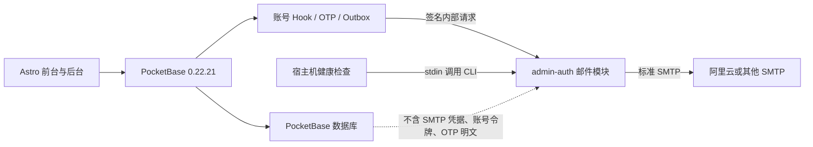

# 通用 SMTP 邮件网关、OTP 与邮件管理中心设计

日期：2026-07-13  
状态：架构与 OTP 方案已确认，等待书面规格审阅  
适用版本：PocketBase 0.22.21、PocketBase JS SDK 0.27、Astro 6、现有 Docker Compose 生产架构

## 1. 已确认决策

1. 复用现有 `admin-auth` Node 服务，增加彼此隔离的邮件传输模块，不新增常驻邮件容器。
2. 邮件传输使用 Nodemailer 和标准 SMTP。阿里云邮件推送作为首个生产服务商，但业务代码不依赖阿里云专有 API。
3. PocketBase 负责事件、模板、队列、权限和审计，通过内部鉴权协议调用邮件网关。
4. SMTP 用户名、密码及连接参数只存在于服务器环境配置，不进入 PocketBase 数据库、API、前端、日志或 Git。
5. PocketBase 0.22.21 没有原生 OTP 登录能力。保留该版本并实现项目内自定义 OTP，暂不进行高风险的 PocketBase 全量升级。
6. 所有正式改动先在当前电脑完成自动化测试和 Mailpit 端到端验证，得到明确批准后才部署服务器。

本文件取代已损坏且基于错误 SMTP 假设的旧草稿 `2026-07-13-mail-service-management-design.md`。

## 2. 当前事实与约束

- 生产 PocketBase 固定为 `0.22.21`，前端使用 PocketBase JS SDK `0.27`。
- 当前 `configure_smtp.pb.js` 调用 `$app.save(settings)`，该方法在 0.22.21 不存在；本机启动测试已复现失败。
- 对 `$app.settings()` 做运行时内存修改不会稳定传递到后续请求，不能用来满足“SMTP 密码不落库”。
- PocketBase 0.22.21 的 Mailer Before Hook 会在默认发送前执行。JS Hook 成功转发后返回 `false`，会停止 Hook 传播并跳过默认 `MailClient.Send`，同时对调用方返回成功。因此可以无重复发送地转交内部网关。
- 当前 OTP 页面调用 SDK 的 `requestOTP` 和 `authWithOTP`，但 0.22.21 服务端没有对应 API，现状不可用。
- 本机已完成最小邮件网关原型验证：PocketBase 经内部 HTTP 调用 Node，Node 经标准 SMTP 把邮件送入 Mailpit；未授权请求被拒绝，测试 SMTP 密码未写入 PocketBase 数据库。
- 生产服务器内存有限。方案不能增加无必要的常驻服务，也不能让 SMTP 故障导致后台 Passkey 服务被判定为不健康。

参考实现语义：

- [PocketBase 0.22.21 `mails/record.go`](https://github.com/pocketbase/pocketbase/blob/v0.22.21/mails/record.go)
- [PocketBase 0.22.21 `plugins/jsvm/binds.go`](https://github.com/pocketbase/pocketbase/blob/v0.22.21/plugins/jsvm/binds.go)
- [PocketBase 0.23 JSVM 迁移说明](https://pocketbase.io/v023upgrade/jsvm/)

## 3. 目标

1. 支持阿里云邮件推送，并兼容任何提供标准 SMTP 的服务商。
2. 完成注册验证、密码重置、邮箱变更和普通读者 OTP 登录四类账号邮件。
3. 完成新评论、评论审核通过和回复三类业务通知。
4. 完成备份失败、容器异常、站点健康检查失败、磁盘阈值和恢复通知。
5. 提供仅 `super_admin` 可访问的 `/admin/mail` 邮件管理中心。
6. 为业务通知提供持久化 Outbox、去重、重试、取消、诊断和最小投递日志。
7. 修复现有邮件内容乱码、损坏 HTML、缺失页面和错误 SMTP Hook。
8. 保持现有登录、后台 Passkey、评论保存和站点浏览在邮件故障时可用。

## 4. 非目标

- 第一版不提供营销群发、订阅简报、附件、入站邮件或邮件回复处理。
- 第一版不实现多个 SMTP 服务商的自动故障切换；切换服务商通过环境配置并重启 `admin-auth` 完成。
- 第一版不接入阿里云退信 Webhook。永久退信抑制只依据明确 SMTP 状态或管理员操作。
- 第一版不把运维告警模板交给 PocketBase 管理，因为告警必须在 PocketBase 停止时仍能工作。
- 第一版不升级 PocketBase，也不迁移全部现有 Hook 到 0.23 之后的新事件 API。
- 不提供任何读取、修改、导出或回显 SMTP 密码的后台能力。

## 5. 总体架构

### 5.1 `admin-auth` 服务

容器和 Compose 服务名保持不变，避免部署和监控迁移。代码内部新增独立邮件模块：

- `mail-config`：读取、校验并脱敏展示 SMTP 环境配置。
- `mail-transport`：封装 Nodemailer transport、TLS 策略、超时和错误分类。
- `mail-request`：验证内部签名、限制请求大小、校验收件人和正文。
- `mail-cli`：供宿主机运维检查通过 stdin 发送固定类型告警。

邮件模块失败不能影响 WebAuthn 和会话校验。现有 `/health` 只表示 Node 服务及认证模块存活；SMTP 状态通过受保护的独立接口查询。SMTP 缺失或不可用时，邮件接口返回受控错误，`admin-auth` 容器仍保持健康。

### 5.2 PocketBase

PocketBase 继续拥有业务状态，但不拥有 SMTP 凭据：

- Mailer Before Hook 拦截账号邮件，渲染后同步转发给内部网关并返回 `false`，阻止默认发送。
- 自定义 OTP 路由生成和核验挑战，成功后使用 PocketBase 标准认证响应签发登录令牌。
- 评论事件只写 Outbox，不在评论请求中直接连接 SMTP。
- 定时任务处理 Outbox、恢复陈旧锁和清理过期数据。
- 邮件管理 API 执行角色、Passkey 会话、字段脱敏和审计检查。

### 5.3 Astro 前端

- 登录页 OTP 表单改用项目自定义 OTP API，不再调用服务端不存在的原生 OTP API。
- 增加忘记密码、重置密码、邮箱变更及确认页面。
- 增加 `/admin/mail`，沿用现有 `AdminLayout`、侧栏和权限模型。
- 所有公共账号请求使用防枚举文案，不显示原始后端或 SMTP 错误。

### 5.4 宿主机告警

宿主机定时脚本检查容器、公共健康接口、备份时效和磁盘使用率。脚本把结构化事件经 stdin 传给 `admin-auth` 容器内的 `mail-cli`，复用同一 SMTP 模块，不依赖 PocketBase。

如果 Docker 或 `admin-auth` 本身不可用，邮件通道也不可用，此时只写入 journald。这是单通道架构的已知限制，不伪装为已发送。

## 6. 配置与凭据边界

### 6.1 通用环境变量

| 变量 | 用途 |
| --- | --- |
| `SMTP_HOST` | SMTP 主机 |
| `SMTP_PORT` | SMTP 端口 |
| `SMTP_USERNAME` | SMTP 用户名 |
| `SMTP_PASSWORD` | SMTP 密码或专用凭据 |
| `SMTP_FROM_ADDRESS` | 已验证发件地址 |
| `SMTP_FROM_NAME` | 发件人名称 |
| `SMTP_TLS_MODE` | `implicit`、`starttls` 或 `auto` |
| `SMTP_CONNECTION_TIMEOUT_MS` | 建连超时，使用受限默认值 |
| `SMTP_SOCKET_TIMEOUT_MS` | 发送超时，使用受限默认值 |
| `MAIL_PROVIDER_LABEL` | 后台显示的非敏感服务商标签 |
| `MAIL_INTERNAL_SECRET` | PocketBase 到网关的独立签名密钥，至少 32 字符 |
| `MAIL_HASH_SECRET` | OTP、邮箱和 IP 的 HMAC 密钥，至少 32 字符 |
| `MAIL_ADMIN_RECIPIENTS` | 业务管理员通知地址 |
| `MAIL_ALERT_RECIPIENTS` | 宿主机告警地址 |
| `PUBLIC_SITE_URL` | 邮件链接使用的站点根地址 |

兼容迁移规则：通用 `SMTP_*` 缺失时，`admin-auth` 可读取现有 `ALIYUN_SMTP_*` 和 `ALIYUN_FROM_*` 别名。新部署文档只推荐通用变量。`SMTP_TLS_MODE=auto` 时，465 使用隐式 TLS，其余端口使用 STARTTLS；生产不允许明文 SMTP。

### 6.2 Compose 边界

- SMTP 连接变量只注入 `admin-auth`。
- PocketBase 只接收 `MAIL_INTERNAL_SECRET`、`MAIL_HASH_SECRET`、内部 URL、功能开关和非敏感站点配置。
- 移除 PocketBase 中的 `ALIYUN_SMTP_PASSWORD` 等变量，并删除失效的 `configure_smtp.pb.js`。
- 生产环境文件由 root 持有，权限 `0600`，不打入发布包和镜像。
- 后台状态 API 只返回 `configured`、服务商标签、端口、TLS 模式、发件域名和最近检查时间；不返回主机、用户名、密码或完整发件地址。

## 7. 内部邮件协议

### 7.1 接口

- `POST /internal/mail/send`：发送一封邮件。
- `POST /internal/mail/verify`：执行 SMTP 连接验证，不发送邮件。
- `GET /internal/mail/status`：返回脱敏状态。

接口只在 Docker `blog_network` 暴露，不映射宿主机公网端口。

### 7.2 请求认证

邮件接口使用独立 HMAC，而不是复用 WebAuthn 的简单共享头：

- `X-Mail-Timestamp`：Unix 秒，允许最大 60 秒时钟偏差。
- `X-Mail-Nonce`：每次请求的随机值。
- `X-Mail-Signature`：对时间、nonce 和原始请求体摘要计算 HMAC-SHA256。
- 网关使用常量时间比较，并用有上限的短期 nonce 缓存拒绝重放。

签名失败返回 `401`，不说明是时间、nonce 还是签名错误。日志不记录签名和请求体。

### 7.3 发送契约

每个请求只允许一个收件人，字段包括：

- `requestId`：审计和关联 ID，不含用户数据。
- `messageId`：稳定的邮件 Message-ID；Outbox 使用记录 ID 派生。
- `category`：固定枚举，不接受任意日志标签。
- `to`：完整地址只存在于受保护的内部请求。
- `subject`：移除 CR/LF，最大 255 字符。
- `html`：最大 256 KiB。
- `text`：最大 128 KiB，必须与 HTML 同时提供。

第一版不允许调用方指定 `from`、附件、任意 Header、抄送或密送。发件人固定取自环境配置，防止网关成为开放邮件中继。

## 8. 账号邮件

| 类型 | 触发方式 | 发送策略 | 失败策略 |
| --- | --- | --- | --- |
| 注册验证 | 注册后自动请求或用户重发 | Mailer Hook 同步转发 | 注册不回滚；记录失败，允许重发 |
| 密码重置 | 公共请求 | Mailer Hook 同步转发 | 始终返回统一受理文案，防止账号枚举 |
| 邮箱变更 | 已登录用户请求 | Mailer Hook 同步转发到新邮箱 | 保持旧邮箱，允许重新请求 |
| OTP 登录 | 自定义 OTP 请求 | 生成挑战后同步转发 | 始终返回统一受理响应 |

验证、密码重置和邮箱变更继续使用 PocketBase 自己生成和验证的令牌。Hook 只在内存中读取 `e.meta.token`，使用受控模板渲染后立即发送；令牌不能写入 Outbox、投递日志、审计日志或错误日志。

账号邮件不进入持久 Outbox，因为持久化可重试会延长令牌暴露面。失败后由用户重新请求新令牌。邮件管理中心只保存最小结果，例如类型、脱敏地址、HMAC 地址标识、耗时、错误分类和时间。

为防止存在性侧信道，公共请求即使在网关失败时也返回相同外观的响应。真实失败只能由后台邮件管理中心和服务端脱敏日志观察。

## 9. 自定义 OTP 登录

### 9.1 适用范围

- 只允许 `role = reader` 且邮箱已经验证的账户使用。
- `author`、`admin`、`super_admin` 不能通过 OTP 绕过密码和 Passkey 流程。
- 不存在、未验证或高权限邮箱都走相同的防枚举响应和近似处理路径。

### 9.2 请求接口

`POST /api/blog-auth/otp/request`

1. 规范化邮箱并校验请求大小和格式。
2. 使用 `MAIL_HASH_SECRET` 对邮箱和来源 IP 做带命名空间的 HMAC。
3. 查询近期挑战，执行每 IP、每邮箱和全局限流。
4. 始终创建一个随机挑战 ID。有效 reader 关联用户；其他情况创建无用户的诱饵挑战。
5. 使用 `$security.randomStringWithAlphabet(6, "0123456789")` 生成加密安全的六位验证码。
6. 只保存 `HMAC(challengeId + code)`，绝不保存验证码明文。
7. 仅对有效 reader 发送 OTP 邮件；接口始终返回相同结构和 `202`。

`POST /api/blog-auth/otp/verify`

1. 接收挑战 ID 和六位验证码，限制请求体大小。
2. 使用常量时间比较验证码 HMAC。
3. 挑战有效期 10 分钟，最多失败 5 次。
4. 在事务内执行比较、增加尝试次数和一次性消费，阻止并发重复使用。
5. 成功后使该用户其他有效挑战失效。
6. 再次确认用户仍为已验证 `reader`，然后调用 `$apis.recordAuthResponse` 返回标准 PocketBase 认证结果。
7. 失败只返回统一错误，不区分不存在、过期、角色不符或验证码错误。

挑战保留 24 小时用于限流和安全审计，然后定时删除。数据库只包含挑战随机 ID、用户可选关系、HMAC、时间、尝试次数和消费状态。

### 9.3 限流默认值

- 每个邮箱 15 分钟最多 3 次请求。
- 每个 IP 15 分钟最多 5 次请求。
- 全局每分钟最多 30 次请求。
- 单个挑战最多 5 次验证。
- 成功登录后不立即清除用于请求限流的历史记录。

这些限制持久化依赖挑战记录，不因 PocketBase 重启而失效。响应时间加入小范围固定下限，减少有效账户和诱饵路径的明显时序差异。

## 10. 评论通知与 Outbox

### 10.1 事件

| 事件 | 收件人 | 去重规则 |
| --- | --- | --- |
| 新评论 | 文章作者和配置的管理员 | 评论者不通知自己，相同地址只发一次 |
| 审核通过 | 原评论者 | 只对首次从非公开状态变为 `approved` 发送 |
| 回复通知 | 被回复评论的作者 | 回复者与收件人相同则跳过，未公开内容不外发 |

评论保存和审核操作只负责创建 Outbox 记录。SMTP 或模板故障不能回滚评论业务。

### 10.2 处理状态

状态为 `pending`、`processing`、`retry`、`sent`、`failed`、`cancelled`。单实例 PocketBase 每分钟领取有限批次：

1. 原子领取到期记录并写入锁和处理者标识。
2. 五分钟以上的陈旧 `processing` 锁可恢复为 `retry`。
3. 检查规则、模板、抑制名单和收件人。
4. 渲染 HTML 与纯文本，调用内部网关。
5. 成功后清除不再需要的 payload，写最小投递日志。
6. 临时失败按 1 分钟、5 分钟、30 分钟、2 小时、12 小时退避，最多 5 次。
7. 永久收件人错误直接失败；认证、配置和全局网络错误暂停当前批次，避免误伤全部地址。

每条 Outbox 只对应一个收件人。`dedupe_key` 对事件、源记录、收件人 HMAC 和状态转换建立唯一索引。

SMTP 无法提供严格的 exactly-once。若服务商已接收邮件但响应丢失，重试可能产生重复邮件。系统使用稳定 Message-ID 和 Outbox 去重降低概率，并在规格中明确该限制。

## 11. 运维告警

宿主机检查以下项目：

- `blog-caddy`、`blog-pocketbase`、`blog-admin-auth` 是否运行且健康。
- `https://hlydwz.com/api/health` 是否成功。
- 最近生产备份是否存在且未超过允许时限。
- 磁盘使用率是否超过阈值。

每个检查项维护 `healthy`、`firing`、`recovered` 状态。首次失败发送告警，持续失败按冷却时间提醒，恢复后只发送一次恢复邮件。状态文件存放在 `/var/lib/hlydwz-monitor/state.json`，权限 `0600`。

告警模板和收件人由宿主机环境与代码管理，避免 PocketBase 故障时无法读取。后台邮件中心可展示最近告警投递摘要，但第一版不编辑运维模板。

## 12. 数据模型

所有以下集合默认 API 规则为 `null`，前端不能直接访问。邮件管理中心通过受保护的自定义 API 返回脱敏 DTO。

### 12.1 `mail_outbox`

- `event_type`、`template_key`
- `recipient`、`recipient_name`、`recipient_hash`
- `payload`：只含渲染所需最小业务数据，禁止令牌、密码、Cookie、Authorization 和 SMTP 配置
- `status`、`attempts`、`max_attempts`、`next_attempt_at`
- `dedupe_key`
- `locked_at`、`locked_by`
- `last_error_code`、`last_error_summary`
- `sent_at`、`source_collection`、`source_id`

已发送和取消记录保留 30 天，最终失败保留 90 天。

### 12.2 `mail_templates`

- `key`、`name`、`category`、`version`
- `subject_template`
- `content`：结构化 JSON，包括预标题、标题、段落、按钮和页脚
- `updated_by`

账号安全模板不能停用。评论通知模板可由对应规则停用。恢复默认模板会创建新版本，不覆盖审计历史。

### 12.3 `mail_rules`

- `event_type` 唯一
- `enabled`
- 作者、评论者和管理员通知策略
- 经过规范化和去重的管理员收件人
- `max_attempts`

账号安全邮件不受普通通知开关控制。运维规则由宿主机配置控制。

### 12.4 `mail_suppressions`

- `recipient`、`recipient_hash`
- `reason`、`source`、`enabled`
- `last_error_code`、`expires_at`

只有明确的永久地址错误才自动抑制。SMTP 认证、连接失败、限流和临时 4xx 不得抑制收件人。

### 12.5 `mail_delivery_logs`

- `request_id`、`category`、`source_id`
- 脱敏地址和地址 HMAC
- `result`、`duration_ms`、`attempt`
- `error_code`、`provider_label`、`created`

不保存正文、模板 payload、令牌、验证码、SMTP 响应原文或凭据。

### 12.6 `auth_otp_challenges`

- `challenge_id` 唯一随机值
- 可选 `user` 关系
- `email_hash`、`ip_hash`、`code_hash`
- `expires_at`、`attempts`、`consumed_at`

无公开规则，无明文邮箱和验证码。诱饵挑战的 `user` 为空。

## 13. 邮件管理中心

新增 `/admin/mail`，放入后台“系统”分组，只允许 `super_admin`、已验证邮箱、有效 Passkey 会话且满足现有后台 IP 边界的用户访问。

### 13.1 概览

- 邮件网关是否配置、SMTP 验证结果、服务商标签、端口和 TLS 模式。
- 24 小时发送量、成功率、待发送、重试中和最终失败数量。
- 最近失败的脱敏摘要。
- “验证连接”和“发送测试邮件”命令。

测试邮件只能发送到当前已验证的 `super_admin` 邮箱，每 15 分钟最多 3 次，不能把网关当作任意地址发送器。

### 13.2 发件队列

- 按类型、状态、脱敏收件人和时间筛选。
- 查看尝试次数、下次重试、错误分类和源记录。
- 对允许状态执行单条或批量重试、取消。
- 已发送记录不能重新发送；需要重新触发业务事件。

### 13.3 模板

- 编辑主题和结构化内容，不允许任意脚本或原始可执行 HTML。
- 展示每种模板允许变量，未知变量使预览和保存失败。
- 使用固定示例数据进行桌面、移动和纯文本预览。
- 保存新版本、测试发送和恢复代码内置默认值。

### 13.4 通知规则

- 管理评论类事件开关、收件策略、管理员地址和最大重试次数。
- 地址在保存前校验、规范化和去重。
- 账号安全邮件和宿主机告警只读展示其控制来源，避免产生虚假的可编辑开关。

### 13.5 抑制名单与投递日志

- 查看脱敏地址、原因、来源、错误分类和时间。
- 手动添加、恢复或设置过期时间。
- 查询最小投递记录，不支持导出正文或凭据。

所有命令保持现有后台紧凑、可扫描的布局，不使用页面说明性营销内容。表格和工具栏设置稳定尺寸，移动端改为有明确字段标签的列表，避免文字和操作重叠。

## 14. 模板与内容安全

- 默认模板为 UTF-8 中文，同时生成 HTML 和纯文本。
- 每个模板声明变量白名单，未知或缺失必需变量会阻止发送。
- 所有动态文本做上下文转义；URL 只允许 `https:`，本地测试允许 `http://localhost` 和 `http://127.0.0.1`。
- 评论正文只显示转义后的限长片段。
- 模板不加载第三方脚本、字体、追踪像素或不受控远程图片。
- 邮件按钮之外提供可复制纯链接。
- 账号令牌只在单次渲染内存中出现；预览使用固定假令牌。

## 15. 错误分类与日志

网关只返回稳定分类：

- `MAIL_NOT_CONFIGURED`
- `SMTP_AUTH`
- `SMTP_CONNECTION`
- `SMTP_TIMEOUT`
- `RECIPIENT_TEMPORARY`
- `RECIPIENT_PERMANENT`
- `PAYLOAD_INVALID`
- `RATE_LIMITED`
- `INTERNAL_ERROR`

网关不得向 PocketBase 返回原始 SMTP 对话、认证响应或堆栈。日志只记录请求 ID、类别、耗时和错误分类。任何异常对象在记录前都经过字段白名单和敏感模式清除。

## 16. 权限、审计与防滥用

- 所有邮件管理 API 都在服务端重新验证 `super_admin` 和有效 Passkey 会话，不能只依赖 React `AdminGuard`。
- 新集合加入现有受保护集合清单，但管理操作优先走自定义 API，防止原始收件地址泄露给前端。
- 模板、规则、队列、抑制名单、SMTP 检查和测试发送都写入现有 `audit_logs`。
- 审计摘要不包含完整邮箱、正文、模板 payload 或网关响应。
- 公共邮件请求同时使用持久限流和 Caddy 层请求大小限制。
- 内部网关限制正文、主题和地址数量，拒绝 CRLF 注入和无效 Unicode 控制字符。

## 17. 功能开关、部署与回滚

功能开关分开控制：

- `MAIL_GATEWAY_ENABLED`：允许 PocketBase 调用内部网关。
- `MAIL_ACCOUNT_ENABLED`：启用账号 Mailer Hook 拦截。
- `MAIL_OTP_ENABLED`：开放自定义 OTP 路由。
- 评论通知由 `mail_rules` 控制，迁移后默认关闭。

部署顺序：

1. 在当前电脑完成 Node 单元测试、PocketBase 临时数据库迁移和 Mailpit 集成测试。
2. 构建 Astro，执行全部 Hook 语法检查和现有回归测试。
3. 备份生产 PocketBase 数据、环境配置和当前 release。
4. 在隔离数据库执行新增迁移并检查 API 规则。
5. 部署代码，先保持账号、OTP 和评论通知开关关闭。
6. 把 SMTP 凭据只配置到 `admin-auth`，重建该服务并验证 WebAuthn 健康未受影响。
7. 验证 SMTP 连接并向当前管理员发送一封测试邮件。
8. 依次启用账号邮件、OTP 和评论通知，每一步单独验收。
9. 最后安装并验证宿主机告警定时器。

回滚时先关闭通知和 OTP，保留新增集合及诊断记录，再切回旧 release。紧急回滚不删除迁移数据。旧版本邮件功能可能不可用，但核心站点和原有认证必须恢复。

## 18. 测试策略

### 18.1 Node 单元测试

- 通用变量和阿里云旧变量的优先级。
- TLS 模式、端口、超时和缺失配置处理。
- HMAC、时间偏差、nonce 重放和常量时间认证。
- 请求大小、单收件人、Header 注入和正文限制。
- SMTP 错误分类与日志脱敏。
- 邮件模块故障不影响 `/health`、WebAuthn 和会话接口。

### 18.2 PocketBase 自动化测试

- 全新数据库执行全部迁移，验证集合、索引和 API 规则。
- Mailer Hook 成功时只调用网关一次并阻止默认发送。
- Mailer Hook 失败时账号令牌不落库且公共响应不枚举账号。
- OTP 有效、诱饵、过期、错误次数、并发消费、限流和高权限拒绝测试。
- 评论事件收件人、去重、状态转换和业务不阻塞测试。
- Outbox 锁、陈旧锁恢复、退避、暂停批次、抑制和清理测试。
- 邮件管理 API 的角色、Passkey、脱敏、限流和审计测试。

### 18.3 本机集成测试

本机无 Docker，使用现有 PocketBase 0.22.21 二进制、临时数据库、Node `admin-auth` 和 Mailpit：

- Mailpit 绑定 `127.0.0.1:1125`，管理界面绑定 `127.0.0.1:8125`，避开本机已占用的 1025。
- 测试环境强制收件人白名单，禁止向互联网真实地址发送。
- 验证注册、验证重发、密码重置、邮箱变更、OTP、三类评论通知和测试邮件。
- 断开 Mailpit 模拟临时故障，验证 Outbox 重试和账号防枚举响应。
- 扫描临时 PocketBase 数据库、Astro `dist`、测试日志和 Git diff，确认不存在测试 SMTP 密码、令牌或 OTP 明文。

### 18.4 前端验证

- Astro 构建及现有移动端检查通过。
- OTP、忘记密码、重置和邮箱变更流程可键盘操作，状态文案不重叠。
- `/admin/mail` 在桌面和移动视口可用，长主题、错误摘要和地址不会撑破布局。
- Playwright 验证登录、邮件管理权限和核心页面无回归。

### 18.5 生产验收

- 阿里云 SMTP 真实测试邮件成功。
- 切换到另一套标准 SMTP 测试配置只需更改环境变量，不改业务代码。
- 四类账号邮件各完成一次端到端验证。
- OTP 只允许已验证 reader，管理员无法通过 OTP 登录。
- 三类评论通知完成入队、发送、去重和失败重试验证。
- 人工触发一次运维故障与恢复，分别收到一封告警和恢复邮件。
- 后台管理中心完成状态、模板、规则、队列、抑制和日志操作。
- SMTP 密码未出现在 PocketBase 数据库、API、前端构建、Git 和日志中。
- 公网健康、登录、归档、评论和后台 IP 策略无回归。

## 19. 完成标准

只有同时满足以下条件，邮件目标才算完成：

1. 账号邮件、OTP、评论通知、运维告警和邮件管理中心均有实现及端到端证据。
2. 本机全套测试通过，生产真实 SMTP 验收通过。
3. 任何邮件故障不会拖垮 `admin-auth` 健康、评论保存或站点浏览。
4. SMTP 密码、账号令牌和 OTP 明文的全路径扫描均为零发现。
5. 所有后台写操作满足 `super_admin`、已验证邮箱、Passkey 会话和审计要求。
6. 生产部署和回滚都经过健康检查，且没有依赖未验证的 PocketBase 版本行为。
