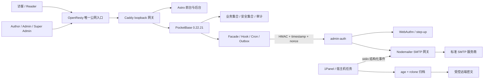

# 个人博客前后端完整运营闭环设计

日期：2026-07-20
状态：已确认设计重建版
目标分支：`codex/mail-security-integration`
当前基线：`429455a7e6df0eda29d92a13491ed7bcf3fea0d8`
原始确认对话：`019f6088-9f39-7871-8e35-9f9e29a251ca`

## 1. 文档定位

本文件重建已经确认的个人博客前后端完整运营闭环，并把后续已经落地的邮件安全、账户生命周期、访问统计、友链排行、留言板和相册后端契约纳入同一设计。

它不是“当前代码全部完成”的声明，而是同时承担三种职责：

1. 记录当前分支已经实现并通过门禁的能力。
2. 固化已确认但尚未补齐的前端或管理端闭环。
3. 给上线、运维、回滚和验收提供统一边界。

发生冲突时按以下优先级解释：

1. 当前分支已提交代码和迁移决定“现状如何运行”。
2. 本文件决定“完整闭环最终应达到什么状态”。
3. 旧规格只作为决策证据，不得把已淘汰的 PocketBase 直连 SMTP、公开原生发信入口或弱化安全边界重新引入。

本次提交只重建设计文档，不修改前端、后端、迁移、脚本、配置或部署状态。

## 2. 运营目标

博客不是单纯的文章展示页。完整运营闭环必须让以下链路互相连接：

- 内容生产：选题、撰写、发布、分类、媒体和公告。
- 用户增长：注册、验证、登录、找回账户、互动和回访。
- 内容反馈：访问趋势、热门内容、友链点击、评论和留言。
- 管理治理：审核、权限、Passkey step-up、安全策略和审计。
- 事务通知：账户邮件、评论通知、生命周期提醒和运维告警。
- 数据治理：最小日志、在线保留、加密归档、云端过期和恢复演练。
- 运行保障：预检、灰度切换、故障降级、回滚和人工验收。

最终形成：

```text
发布内容
  -> 用户发现与访问
  -> 聚合统计和轻互动
  -> 后台获得可行动反馈
  -> 调整内容、审核互动、维护关系
  -> 邮件通知促成验证、回访或处置
  -> 安全审计、保留和归档
  -> 下一轮内容与运营决策
```

## 3. 范围与非目标

### 3.1 范围

- Astro 前台、账户页和管理后台。
- PocketBase 数据、Hook、自定义 API、定时任务和审计。
- `admin-auth` 内部认证、Passkey 和通用 SMTP 网关。
- OpenResty、Caddy、Docker Compose 与宿主机计划任务的信任边界。
- 文章、标签、评论、公告、媒体、友链、访问统计、留言板、相册和用户治理。
- 注册验证、密码重置、邮箱变更、Reader OTP、评论通知、账户保留提醒和运维告警。
- 邮件投递日志、加密归档、远端 90 天保留和月度恢复演练。

### 3.2 非目标

- 不建设营销群发、订阅简报、广告投放或用户画像平台。
- 不建设复杂社交关系、私信、关注流或开放式社区。
- 不允许 SMTP 凭据、age 私钥、rclone 凭据进入前端、PocketBase 数据库、Git 或普通诊断日志。
- 不通过后台读取、编辑或回显 SMTP 密码。
- 不把 PocketBase 超级管理员控制台伪装成应用内 `super_admin`。
- 不承诺 SMTP 服务商已接收但响应丢失时的严格 exactly-once。
- 不在文档提交中执行生产部署、真实 SMTP、真实归档上传或生产数据操作。

## 4. 当前基线与待闭环项

| 领域 | 当前基线 | 完整闭环要求 |
| --- | --- | --- |
| 注册 | 已有 `/api/blog-auth/register` 与持久限流 | 保持所有前端注册入口只走 facade |
| 邮箱验证 | 已有验证请求 facade 和确认页 | 统一成功、重发、过期和帮助文案 |
| Reader OTP | 后端自定义挑战已实现，前端经封装接入 | 明确 reader-only，管理员始终走密码 + Passkey |
| 密码重置 | 后端请求 facade 已实现 | 补齐“忘记密码”和重置确认页面 |
| 邮箱变更 | 后端请求 facade 已实现 | 补齐已登录用户发起与确认页面 |
| 评论邮件 | 已经改为 Outbox -> 网关 | 后台提供队列、失败和规则视图 |
| 账户保留 | 45 天提醒、60 天复核能力已实现 | 后台只展示状态和安全操作，不提供危险批量删除捷径 |
| 邮件安全 | HMAC、nonce、防重放、最小日志和凭据隔离已实现 | 增加完整 `/admin/mail` 运营面 |
| 访问统计 | 已实现可信 IP、访客 HMAC 和聚合接口 | 后台形成趋势、内容行动和异常反馈 |
| 友链 | 已实现合法目标校验和 30 天 Top 10 | 管理端把排行用于维护、隐藏和更新 |
| 留言板 | 已实现公开展示、反垃圾与精确滚动限流 | 增加受 step-up 保护的隐藏/删除管理入口 |
| 相册 | 前台展示与后端 RBAC/文件限制已实现 | 增加 author/admin 上传与 super_admin 删除界面 |
| 归档 | prepare/export/seal/upload/commit/retention 契约已实现 | 生产只在人工配置 age/rclone 后启用并留恢复证据 |
| 全量门禁 | 当前聚合门禁 28 阶段，Windows 为 26 PASS/2 SKIP | Linux 补跑迁移验证，生产另做真实代理与外部依赖验收 |

待闭环项必须被视为产品与运维缺口，不能被误报成已经存在的功能。

## 5. 总体架构



### 5.1 Astro

Astro 只负责用户体验、表单编排、管理界面和公开内容展示：

- 不保存服务端密钥。
- 不根据客户端角色自行授予权限。
- 后台请求使用 PocketBase SDK 携带认证 token。
- 需要 step-up 的写操作附带短期、会话绑定的管理头。
- 公共账户流程显示稳定文案，不展示 SMTP、SQL、内部路由或异常详情。

### 5.2 PocketBase

PocketBase 是业务状态和授权真源：

- 管理用户、角色、内容、评论、留言、相册和统计。
- 承担注册、账户邮件 facade、Reader OTP 和真实 IP 使用。
- 承担精确持久限流、Outbox、账户保留、审计和归档批次状态。
- 通过 HMAC 内部请求调用 `admin-auth`，不读取 SMTP 凭据。
- 通过私有集合保存最小必要数据，不向前端开放原始安全集合。

### 5.3 `admin-auth`

`admin-auth` 保持单一常驻服务，承担两类彼此隔离的能力：

- WebAuthn、Passkey 和管理员 step-up。
- 标准 SMTP 配置、连接验证、发送、错误分类和运维 CLI。

邮件配置失败不得导致 Passkey 或健康检查整体退出。`/health` 与邮件状态分开，邮件内部路由不映射公网。

### 5.4 代理与宿主机

- OpenResty 是唯一公网可信入口，覆盖客户端伪造的真实 IP 头。
- Caddy 只信任 OpenResty 的实际连接地址，并向 PocketBase 传递 `{client_ip}`。
- PocketBase 业务代码只使用 `e.realIP()`，不得回退到客户端可伪造 Header。
- PocketBase 8090 和 `admin-auth:8787` 不得公开暴露。
- 宿主机负责真实备份、归档、磁盘和容器告警；应用后台不冒充宿主机控制面。

## 6. 角色与权限模型

| 角色 | 主要职责 | 关键限制 |
| --- | --- | --- |
| 匿名访客 | 阅读、搜索、查看公开统计、友链、留言和相册 | 无管理写权限 |
| `reader` | 评论、账户自助、Reader OTP | 不能进入管理后台 |
| `author` | 文章、标签、媒体、相册创建/更新、查看基础统计 | 管理写入需已验证邮箱和 Passkey step-up |
| `admin` | author 能力 + 评论治理和更高管理能力 | 不能删除最后一个超级管理员或越权授予角色 |
| `super_admin` | 用户、友链、设置、安全策略、审计、邮件中心和高风险删除 | 仍需可信管理网络、已验证邮箱和 step-up |
| PocketBase superuser | 受控运维与应急恢复 | 独立凭据与入口，不等同应用角色，写入仍审计 |

前端导航只用于减少误操作。所有权限、step-up、网络、版本冲突和字段约束必须在服务端重新验证。

## 7. 前台用户闭环

### 7.1 发现与阅读

1. 用户通过首页、文章、归档、标签、搜索、项目、友链或订阅页进入内容。
2. 页面浏览通过 `/api/track-view` 发送最小事件。
3. 后端只保存按日轮换的访客 HMAC、规范化路径、来源 origin、UA 分类和事件类型。
4. 公开接口只返回聚合，不返回访客标识或单条访问事件。
5. 后台把趋势用于选题、更新、标签整理和导航优化。

统计采集失败时不影响页面阅读；缺少可信 IP 或 HMAC secret 时零写入并返回稳定不可用码。

### 7.2 注册、验证与登录

```text
注册表单
  -> /api/blog-auth/register
  -> 持久注册配额
  -> 创建 reader
  -> 账户邮件配额
  -> 验证邮件
  -> /verify-email
  -> 已验证 reader
  -> 密码登录或 Reader OTP
```

规则：

- 公开注册不直接调用原生 `users.create()`。
- 新账户固定为 `reader`；角色升级只能由受保护后台执行。
- 注册成功但邮件不可用时保留账户，并允许稍后统一重发验证。
- 验证重发、密码重置和 OTP 对存在/不存在账户使用统一公开响应。
- `author`、`admin`、`super_admin` 不允许 Reader OTP，必须使用密码和 Passkey。

### 7.3 密码重置与邮箱变更

完整前端必须提供：

- “忘记密码”请求页。
- `/reset-password` 令牌确认页。
- 已登录用户邮箱变更发起页。
- `/confirm-email-change` 令牌确认页。
- 统一的过期、已使用、格式错误和重新发起入口。

请求阶段只走 `/api/blog-auth/*` facade；原生公开 request-* 路径保持关闭。令牌确认端点保持可用，但令牌不得进入访问日志、数据库、Outbox、投递日志或审计摘要。

### 7.4 评论、留言与轻互动

- 评论保存与邮件发送解耦：业务记录先成功，通知进入 Outbox。
- 留言板公开只读 `status = show`，创建时清理 HTML、控制字符、重复字符和过多链接。
- 留言板按可信 IP 使用 `guestbook_ip` 精确滚动额度，默认每小时 5 条。
- 同一用户对文章反应等未来轻互动必须去重、限频且不形成复杂社交图谱。
- 所有失败都给出用户可理解的稳定反馈，不回传内部异常。

### 7.5 友链与相册

- 友链点击只接受当前 `status = show` 的精确 URL，防止任意目标污染排行。
- 公开排行固定为近 30 天 Top 10。
- 相册公开只展示 `show`，只允许 JPEG/PNG/WebP/GIF，单文件最大 10 MiB，禁止 SVG。
- 管理端上传和更新需要 author 以上角色及 step-up；删除只允许 `super_admin`。

## 8. 内容运营闭环

### 8.1 内容生产

```text
选题/草稿
  -> 文章编辑
  -> 标签与媒体
  -> 预览
  -> 发布
  -> 前台分发
  -> 统计与评论反馈
  -> 更新、归档或继续扩展
```

后台内容区包括：

- 文章：草稿、发布、更新、精选和归档。
- 标签：分类、聚合、描述和推荐。
- 媒体：安全文件管理和复用。
- 评论：审核、回复、隐藏和删除。
- 友链：展示状态、目标维护和点击反馈。
- 公告：站点级运营信息。
- 相册：上传、排序、分组和可见性。

### 8.2 数据反馈

后台统计至少回答：

- 近 7/30 天浏览趋势是否变化。
- 哪些页面和文章获得最多访问。
- 哪些来源 origin 带来有效访问。
- 哪些友链获得最多真实点击。
- 评论、留言、验证和邮件失败是否出现异常增长。

统计页不提供任意查询平台，不返回原始 IP、访客 HMAC、完整 referrer、单条轨迹或跨日画像。

### 8.3 运营动作

数据只在能驱动行动时展示：

- 热门内容：补充更新、关联文章、首页精选。
- 搜索或标签缺口：调整分类和导航。
- 友链排行：维护失效链接、优化展示。
- 评论与留言风险：审核、隐藏、调整安全策略。
- 邮件失败：区分内容、临时网络、永久地址或配置故障。
- 注册和限流饱和：人工切换邀请码模式，而不是放宽安全边界。

## 9. 管理后台信息架构

现有后台保持“主控台 / 内容 / 系统”分组，并补齐邮件中心：

| 分组 | 页面 | 最低角色 |
| --- | --- | --- |
| 主控台 | 仪表盘、统计 | `author` |
| 内容 | 文章、评论、标签、媒体、相册 | 按页面为 `author` 或 `admin` |
| 关系 | 友链、留言治理 | `super_admin` |
| 系统 | 用户、公告、设置、安全、审计、邮件 | `super_admin` |

### 9.1 管理通用交互

- 桌面使用稳定列宽表格，移动端转为带字段标签的卡片列表。
- 危险操作必须二次确认，并明确影响对象与不可逆性。
- 过期 step-up 不自动重试写操作，而是提示重新 Passkey 验证。
- `409` 版本冲突显示“数据已变化，请刷新后重试”，不得覆盖他人更新。
- 所有错误使用稳定码和 `referenceId`，不展示堆栈或原始异常。

### 9.2 `/admin/mail`

邮件中心是运营闭环的缺失管理面，必须包含：

1. 概览：网关配置状态、最近验证、24 小时发送量、成功率、等待、重试和最终失败。
2. 队列：按类型、状态、脱敏收件人和时间筛选 Outbox。
3. 模板：结构化主题、正文、允许变量、版本、预览、测试发送和恢复默认。
4. 规则：评论通知开关、管理员收件策略、重试上限和只读系统来源。
5. 抑制：永久地址错误的受控抑制与解除。
6. 日志：最小投递摘要，不显示正文、token、验证码或 SMTP 原文。
7. 连接验证：只验证 SMTP 连接；测试邮件只能发到当前已验证超级管理员或服务器 allowlist。

访问条件同时为 `super_admin`、已验证邮箱、可信管理网络和有效 Passkey step-up。

## 10. 邮件与通知闭环

### 10.1 事务邮件分类

| 分类 | 触发 | 投递策略 |
| --- | --- | --- |
| `account_verification` | 注册或重发验证 | 同步生成短期令牌，不入 Outbox |
| `account_password_reset` | 找回密码 | 同步生成短期令牌，不入 Outbox |
| `account_email_change` | 已登录用户换邮 | 发往新邮箱，不入 Outbox |
| `reader_otp` | 已验证 reader 请求验证码 | 自定义挑战，不入 Outbox |
| `comment_new` | 新评论 | 持久 Outbox |
| `account_retention_notice` | 未验证账户 45 天提醒 | 持久 Outbox |
| `admin_test` | 邮件中心测试 | 独立严格配额 |
| `ops_alert` | 容器、站点、备份、磁盘或恢复状态 | 宿主机 CLI，独立于 PocketBase |

历史设计中的评论通过和回复通知可在扩展模板与去重契约后加入，但不能绕过统一 Outbox 和网关。

### 10.2 发送路径

```text
业务事件
  -> PocketBase 校验、权限、配额和模板
  -> HMAC(timestamp + nonce + method + path + body hash)
  -> admin-auth 内部邮件 API
  -> 固定发件人 Nodemailer transport
  -> 标准 SMTP
  -> 最小投递结果
  -> PocketBase 日志 / Outbox 状态 / 后台聚合
```

调用方不能指定任意 Header、附件、抄送、密送或发件人。每个内部请求只允许一个收件人，正文和主题均有硬上限。

### 10.3 Outbox

- 评论与账户保留提醒先创建业务记录，再入 Outbox。
- `dedupe_key` 必须唯一，单条记录只对应一个收件人。
- 状态为 `pending`、`processing`、`retry`、`sent`、`failed`、`cancelled`。
- Worker 每分钟领取有界批次，使用租约防并发重复处理。
- 临时故障退避重试；永久地址错误最终失败。
- 认证、配置或全局网络故障暂停批次，不能误抑制所有地址。
- 已发送记录不允许后台“再次发送”；重新发送必须重新触发合法业务事件。

### 10.4 账户邮件

账户邮件不使用持久 Outbox，因为 token 只能存在于一次 Hook 执行内存中。发送失败时由用户重新请求新 token。

公开请求保持统一 `202 MAIL_REQUEST_ACCEPTED`，但已登录用户可在不泄露其他账户状态的前提下获得自己的详细限流码。

### 10.5 运维告警

宿主机维护 `healthy`、`firing`、`recovered` 状态：

- 首次故障发送一封。
- 持续故障按冷却时间提醒。
- 恢复后发送一封。

Docker 或 `admin-auth` 不可用时只写 journald。运维告警使用独立配额，不能被公开账户邮件或注册攻击耗尽。

## 11. 数据与接口契约

### 11.1 关键公开接口

| 方法与路径 | 用途 |
| --- | --- |
| `POST /api/blog-auth/register` | reader 注册 |
| `POST /api/blog-auth/verification/request` | 验证邮件重发 |
| `POST /api/blog-auth/password-reset/request` | 密码重置请求 |
| `POST /api/blog-auth/email-change/request` | 已登录用户邮箱变更 |
| `POST /api/blog-auth/otp/request` | Reader OTP 请求 |
| `POST /api/blog-auth/otp/verify` | Reader OTP 核验 |
| `POST /api/track-view` | 页面或友链点击事件 |
| `GET /api/blog-stats` | 公开聚合或认证后台详情 |
| `GET /api/friend-link-stats` | 近 30 天公开友链排行 |

所有管理 API 必须使用服务端权限和 step-up 验证；不通过直接开放私有集合代替。

### 11.2 关键数据

- 内容：`posts`、`tags`、`comments`、`media`、`friend_links`、`announcements`。
- 互动：`page_views`、`guestbook_messages`、`gallery_items`。
- 账户：`users`、`auth_otp_challenges`、`account_retention_state`。
- 邮件：`mail_templates`、`mail_outbox`、`mail_delivery_logs`。
- 安全：`security_rate_policies`、`security_rate_buckets`、Passkey/step-up 状态、`audit_logs`。
- 归档：`mail_archive_batches`、归档 nonce 和保留 tombstone。

安全集合默认无公开 API 规则。前端只读取服务端生成的最小 DTO。

## 12. 安全与隐私边界

### 12.1 凭据

- SMTP 主机、用户名、密码只进入 `admin-auth`。
- `MAIL_INTERNAL_SECRET` 只在 PocketBase 与 `admin-auth` 间共享。
- `MAIL_HASH_SECRET` 只进入 PocketBase。
- age 私钥离线双份保管，服务器只持公钥和预期指纹。
- rclone 使用专用低权限账户和独立 prefix。

### 12.2 防滥用

- 账户邮件共享邮箱、IP、全局三层精确滚动额度。
- 注册使用独立 IP、IPv6 `/64` 和全局额度。
- 留言板、评论通知、管理员测试、账户保留和运维告警使用隔离 policy。
- 配置缺失、损坏、SQLite busy、异常未来时间或 HMAC 失败时 fail-closed。
- 后台只能在硬边界内修改策略，使用整组 CAS；不能远程清空全部桶。

### 12.3 最小化

- 不保存原始 IP；需要关联时保存带命名空间 HMAC。
- referrer 只保存 `scheme://host[:port]`。
- 邮件日志不保存完整邮箱、正文、主题、token、OTP、SMTP 原文或堆栈。
- 审计摘要不保存留言正文、相册描述、文件名、step-up header 或完整 IP。
- 公开统计不返回访客 HMAC、单条事件或任意客户端自由文本。

### 12.4 管理写入

高风险管理写入必须同时满足：

- 合法 PocketBase 认证。
- 足够应用角色。
- 邮箱已验证。
- 有效 Passkey step-up。
- step-up 与当前用户、会话、浏览器指纹、可信 IP 和受限 UA 一致。
- 目标记录和版本仍符合操作前提。

## 13. 错误、降级与恢复

| 故障 | 用户体验 | 数据行为 | 运维行为 |
| --- | --- | --- | --- |
| 统计采集失败 | 页面正常 | 零写入 | 固定错误码、聚合告警 |
| 邮件 SMTP 失败 | 公共账户请求仍统一受理 | token 不落库，最小失败摘要 | 邮件中心和告警可见 |
| Outbox 临时失败 | 业务保存成功 | 退避重试 | 超龄或积压告警 |
| 限流存储失败 | 公开邮件统一受理但不发；注册 503 | fail-closed | 安全告警 |
| step-up 过期 | 提示重新验证 | 不执行写入 | 审计拒绝原因 |
| 归档任一步失败 | 无前台影响 | 在线日志不删除 | 保留批次并重试 |
| `admin-auth` 不可用 | Passkey/邮件受影响范围分离 | 不回落 PB 默认 SMTP | `/health` 与邮件状态分开 |
| 代理 IP 链异常 | 受保护写入拒绝或零采集 | 不信任客户端 Header | 必须整单元回滚 |

禁止为了“恢复可用性”重新开放原生匿名注册、PocketBase 默认 SMTP、公开 request-* 发信接口、未验证真实 IP 或绕过 Passkey。

## 14. 保留、归档与恢复

### 14.1 在线保留

- `page_views` 和友链点击保留 90 天。
- OTP 挑战 24 小时后清理。
- 在线邮件投递日志目标保留 7 天。
- Outbox 已发送/取消与最终失败按既定状态保留，不把 token 或正文长期保留。
- 未验证账户第 45 天提醒，第 60 天在无业务关系时复核删除。

### 14.2 加密归档

```text
prepare
  -> 规范 JSONL
  -> gzip
  -> age 公钥加密
  -> 删除明文
  -> rclone 上传
  -> 回读 hash
  -> 上传最小 manifest
  -> PocketBase commit
  -> 删除对应在线日志
```

只有 commit 事务可以删除在线日志。任何 hash、manifest、recipient 指纹、上传或回读失败都必须零误删。

### 14.3 云端保留与恢复

- 密文、manifest、历史版本、删除标记和回收站副本从事件时间起最多保留 90 天。
- 每月在隔离目录执行一次解密、三层 hash、gzip、schema、行数和游标验证。
- 恢复完成后删除全部明文；清理失败即演练失败。
- 恢复记录只保存 batch、行数、时间、操作者和结果，不保存解密内容。

## 15. 可观测性与运营指标

后台和宿主机分别承担不同指标：

### 15.1 后台

- 访问量、趋势、热门内容和来源 origin。
- 友链 30 天点击排行。
- 评论、留言、相册和用户待处理事项。
- 邮件 24 小时发送量、成功率、积压、重试和最终失败。
- 限流策略版本、饱和情况和安全审计。

### 15.2 宿主机

- 容器、Caddy、PocketBase、`admin-auth` 和公网健康。
- 备份时效、磁盘阈值和归档任务。
- 超龄在线邮件日志、未完成归档批次和工作目录明文残留。
- 生产 SMTP、age、rclone 和恢复演练的人工验收记录。

应用后台不得伪造无法从宿主机可靠观察的状态。

## 16. 上线顺序

1. 在隔离数据库验证全新安装和现有数据库升级。
2. 部署加法迁移、安全集合、Hook、管理 API 和前端兼容代码，保持危险任务关闭。
3. 同一维护窗口切换 OpenResty、Caddy、PocketBase 真实 IP 链。
4. 用两个真实测试源和伪造 XFF 验证可信 IP。
5. 在 Mailpit 验证注册、验证重发、密码重置、邮箱变更、OTP、评论 Outbox、账户提醒和管理员测试。
6. 确认所有前端入口只走 facade 后，关闭原生匿名注册和公开 request-* 发信入口。
7. 启用严格默认配额并验证重启、并发和窗口边界。
8. 撤销旧管理员验证会话，要求重新 Passkey step-up。
9. 先启用账户提醒，观察完整周期后再启用删除。
10. 人工配置并核对 age 公钥指纹、rclone 权限和远端删除语义后，最后启用归档。
11. 补齐 `/admin/mail`、密码重置、邮箱变更、留言治理和相册管理界面后，再宣布前后端运营闭环完成。

## 17. 测试与验收

### 17.1 自动门禁

- Astro 构建、Node 测试、PocketBase Hook/迁移 fixture 全部通过。
- stats/friend、guestbook、gallery、邮件、账户保留、归档和 step-up focused runner 通过。
- `scripts/pre-deploy-check.ps1 -Ci` 无 FAIL；平台不适用项只能 SKIP，不能伪装 PASS。
- `scripts/sensitive-check.ps1` 对源码、Git 和构建产物零问题。
- `git diff --check` 通过。

### 17.2 关键安全验收

- 伪造 XFF/X-Real-IP 不影响 `e.realIP()`。
- 账户邮件与注册额度并发不超卖，重启后仍有效。
- 超限、decoy 和未知账户不产生持续写盘副作用。
- Reader OTP 不能登录高权限角色。
- 受保护管理写入不能跨设备、跨会话或无 step-up 执行。
- 公开统计、审计和归档均扫描不到禁止字段。
- 归档每阶段故障注入后数据库零误删。

### 17.3 前端闭环验收

- 注册 -> 验证 -> 密码登录/Reader OTP 全流程可用。
- 忘记密码 -> 邮件 -> 重置确认可用。
- 已登录邮箱变更 -> 新邮箱确认可用。
- 评论保存不因邮件失败回滚，管理员能看到待处理和通知状态。
- 留言和相册有与后端权限一致的管理界面。
- `/admin/mail` 能完成观察、诊断、规则/模板管理和受控测试。
- 桌面、移动、键盘和窄屏下无重叠、不可达操作或横向撑宽。

### 17.4 生产人工验收

- Linux 迁移验证。
- 真实代理链观测。
- 真实 SMTP 连接和受控测试邮件。
- 真实 rclone 上传、回读 hash 和远端 90 天删除语义。
- age 离线私钥恢复演练。
- 生产数据备份、回滚点和操作记录。

## 18. 完成定义

只有同时满足以下条件，才可称为“前后端完整运营闭环”：

1. 用户能从发现内容走到注册、验证、登录、互动和回访。
2. 密码重置和邮箱变更拥有完整前端页面，不依赖手工 API。
3. 内容、评论、标签、媒体、友链、留言、相册和公告都有与权限匹配的管理路径。
4. 访问与互动数据能转化为明确后台运营动作。
5. 评论通知、账户提醒和运维告警都经过统一邮件安全边界。
6. `/admin/mail` 提供可观察、可诊断、可审计但不泄密的运营面。
7. 注册、邮件、留言和管理操作的持久限流在并发与重启下不被绕过。
8. 高风险写入经过角色、可信网络、已验证邮箱和 Passkey step-up。
9. 在线日志只有在加密、上传和回读验证成功后才删除。
10. 自动门禁、独立安全复核和生产人工验收均无未解释的 Critical/Important 问题。

在这些条件全部成立前，应使用“后端安全闭环已完成”“某前端流程已完成”或“待生产验收”等准确表述，不得把局部通过扩大为整站运营闭环完成。
